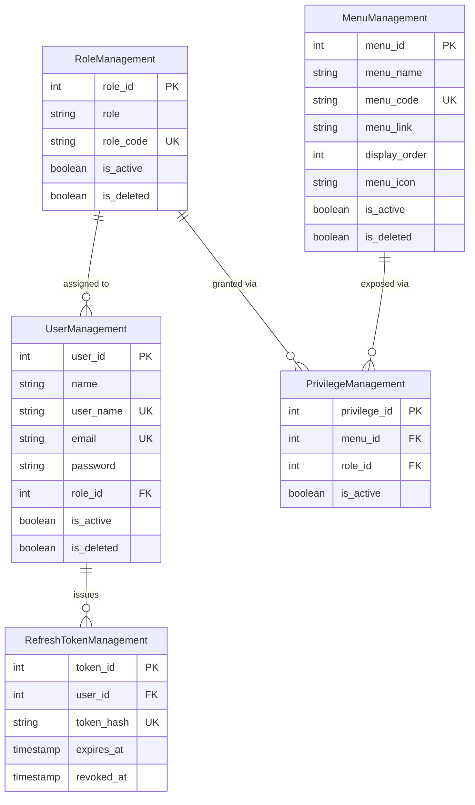

# 🛡️ System-Management (RBAC Auth System)

An enterprise-grade **Role-Based Access Control (RBAC)** authentication system designed for scalability. This foundation dynamically manages users, roles, and menu permissions without requiring frontend redeploys.

> **Why this exists:** Built as the foundational micro-service for multi-tenant SaaS applications to handle complex authorization flows with soft-delete auditing.

---

## 🚀 Key Features

- **🔐 JWT Authentication** – Access/refresh token rotation: short-lived JWT access tokens (15 min) paired with database-backed, revocable refresh tokens (7 days), delivered via secure HttpOnly cookies.
- **♻️ Refresh Token Rotation & Revocation** – Refresh tokens are opaque random strings, SHA-256 hashed before storage in `RefreshTokenManagement`. Every refresh issues a new token and revokes the old one, enabling instant logout, session tracking, and stolen-token detection on reuse.
- **🧩 Dynamic RBAC** – Menus are rendered based on the `PrivilegeManagement` matrix in real-time.
- **🔄 Auto-Assign Logic** – Creating a new Menu/Role automatically propagates permissions across the entire system.
- **🗑️ Soft Deletes & Audit Trails** – Core entity tables (`MenuManagement`, `RoleManagement`, `UserManagement`) support `is_deleted` flags for full audit trails; `PrivilegeManagement` uses `is_active` toggles since it's a junction table; `RefreshTokenManagement` tracks session state via a nullable `revoked_at` timestamp instead, since token history — not soft-deletion — is what matters for session auditing.
- **⚡ Optimized Queries** – Composite indexes and foreign key constraints ensure data integrity.
- **📊 MySQL Transactions** – Ensures atomicity during permission propagation.

---

## 🏗️ Architecture & Database Schema

The system relies on a normalized relational database with 5 core tables:

| Table | Purpose |
| :--- | :--- |
| `MenuManagement` | Stores UI routes, icons, and display orders. |
| `RoleManagement` | Defines user tiers (Admin, Manager, User). |
| `PrivilegeManagement` | **The Matrix** – Maps Menu IDs to Role IDs to control visibility. |
| `UserManagement` | Stores bcryptjs-hashed passwords, linked to a specific Role. |
| `RefreshTokenManagement` | Tracks issued refresh tokens (SHA-256 hashed) per user, supporting rotation and instant revocation. |

### Entity Relationship Diagram (ERD)

